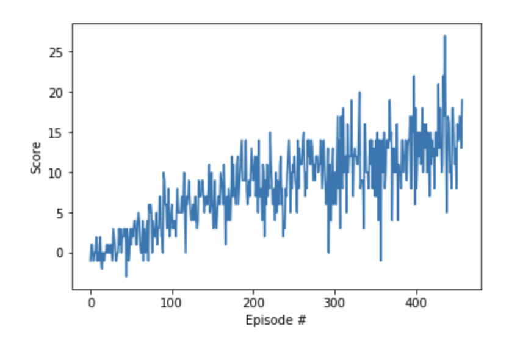

# Report

Goal of this exercise is to teach an agent to collect bannanas. To do that we use a technique called "reinforcement learning" or RL for short.

# Learning algorithm

Learning algorithm that we will use is called "Deep Q Learning" (DQN). The algorithm can be divided into tvo parts - sampling and learning. It works as follows:

Sampling:
1. Choose action A given state S using policy P.
2. Take action A, observe reward R and next state S'.
3. Store experience tuple (S, A, R, S') into replay memory M.

Learning:
4. Obtain random batch of tuples B from M.
5. Set target y = r + discount_rate * max_a(q(S', a, w')
6. Update Q network weights: delta_w = learning_rate * (y - q(S, a, w)) * grad_w(q(S, a, w))
7. Every C steps set w' = w

> The above algorithm is "by the book" algorithm. Algorithm in this project slightly differs from the one above in step 7. Instead of updating weights of target network (w') every C steps we blend weights slowly over time. This method of updating weights is called "soft update".

max_a(f(a)) - function that returns maximum value of f(a) with respect to a. 

grad_w(f(w)) - function that returns gradient of f(w) with respect to w.

The algorithm tries to maximise expected cumulative reward.

# Model architecture

Neural network used for this agent is a three layer network where all layers are fully connected with ReLU activation function used after first and second layer.

#### Hyperparameters

Hyperparameters used with Actor and Critic neural networks are as follows:

| Parameter | Value |
|---|---|
| Learning Rate | 5e-4 |
| Memory Size | 1e5 |
| Memory Batch Size | 64 |
| Gamma (dicounting factor) | 0.99 |
| Tau | 1e-3 |

Following are descriptions of some of the above parameters that might not be straightforward to understand:

* **Memory Size** - Number of entries that can be stored in memory
* **Memory Batch Size** - Numer of entries that will be sampled from memory during learning 
* **Tau** - Rate at which new updated are blended into "fixed" (target) networks

#### Rewards

In the following graph we can see how the agent progressed with learning. We can see that the reward that agent gets on average keeps increasing over time. If we let training process go for longer it is highly likely that agent would achieve better performance.

In the run associated with the graph above the agent achieved an average score of +13 after 458 episodes.

#### Ideas for Future Work

It would be interesting to try teaching the agent how to navigate the environment just from pixels. Another parameter that would be interesting to test is how does size of memory effect agents ability to learn. Is there a point at which memory is too large and inhibits agent's ability to learn? Another experiment worth trying is using some policy based method to learn instead of value based one. For example, using A3C or DDPG sounds interesting.
